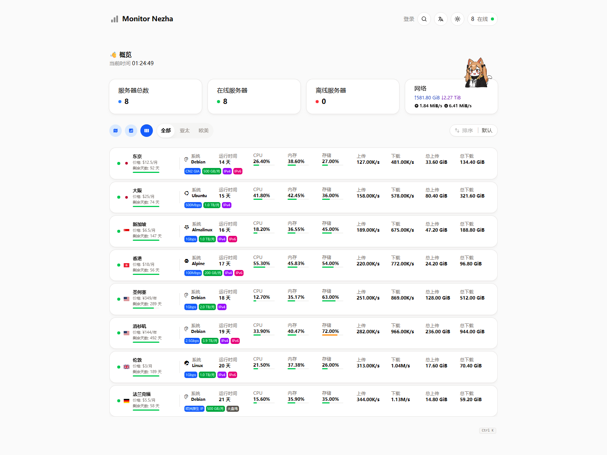
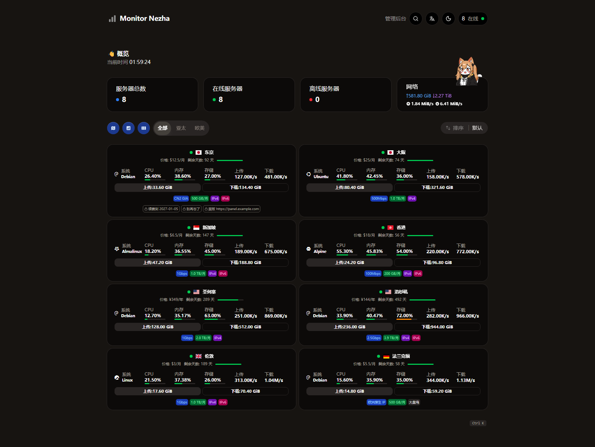
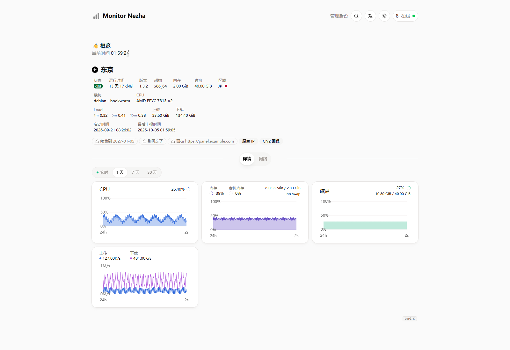
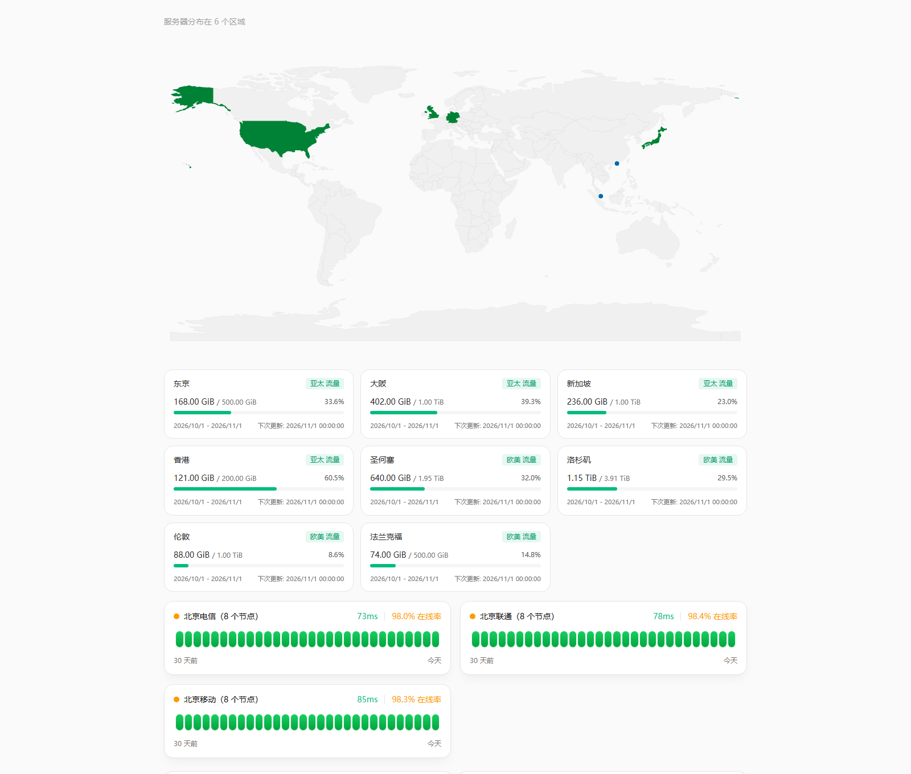

# Monitor Nezha

把 [hamster1963/nezha-dash-v2](https://github.com/hamster1963/nezha-dash-v2)（哪吒监控的官方前端）移植到
[极简探针 Monitor](https://github.com/monitor-probe/monitor) 的主题：界面与上游一致，数据全部来自探针的公开接口 ——
实时快照走 WebSocket（连不上自动回退到 `/api/nodes` 轮询），历史曲线与延迟监控走 `/api/nodes/{id}/metrics`；
字体、国旗与系统图标都打进包里，不依赖第三方 CDN。

## 预览

  
  

  
  

## 主要功能

- **卡片与紧凑列表双视图**：卡片视图排价格、剩余天数、资源进度与上下行速率；紧凑列表把同一批信息压成一行，窄屏自动单列。
- **数据总览**：服务器总数 / 在线 / 离线 / 网络速率四张卡片，数值跟着分组标签走。
- **分组与排序**：hub 里给节点设了分组就会出现分组标签；排序字段与方向可点，站点也能设默认值。
- **全球地图**：按国家点亮并标出节点，悬停看该地区有几台；默认按需加载，不进首屏包。
- **延迟监控**：hub 的 Ping 探测线路按天聚合成 30 天在线率与平均延迟，失败的探测按丢包计。
- **周期流量**：每台节点的流量配额、已用百分比与重置日期。
- **节点详情**：硬件 / 系统 / 存储信息，外加 CPU、内存、磁盘、上下行四条历史曲线；时间范围按 hub 的保留天数给（保留 30 天就是 1 / 7 / 30 天，留 365 天才多出 90 天与 365 天）。
- **节点备注**：卡片底部那排标签与详情页的备注小卡片 —— 公开备注访客可见，私有备注只有登录的管理员看得到（多一枚锁图标）。
- **主题外观**：亮 / 暗 / 跟随系统；站点 Logo、导航链接、桌面与移动端背景图、首页插画、自定义代码都在后台改。
- **多语言**：界面语言 14 种（部分语种由上游社区翻译，未翻译的条目回落到英语），站点可设默认语言，也可以跟随访客。

## 安装

首次安装：从 [Releases](https://github.com/akanotanin/monitor-theme-nezha/releases) 下载 `theme.tar.gz`，在探针后台
「主题」里上传并启用。之后可以在主题卡片上点「从 GitHub 更新」。

## 备注

两个备注字段、摊在哪儿、怎么拆

- 都在 hub 后台的**节点编辑**里：**公开备注**（hub ≥ 1.3.2，单行 ≤100 字）随公开视图下发，匿名访客也拿得到；
  **私有备注**（面板里的 placeholder 是「仅管理员可见」）只下发给登录的管理员。
- **卡片底部那排标签**：先看主题设置里的「标签规则」，规则没匹配到的机器改用**公开备注** —— 逗号分隔＝多枚
  （半角 `,` 与全角 `，` 都认），第一枚进带宽格、其余进灰标签；两个来源都没有的机器，那一排整个不渲染。
- **整页详情**摊的是**私有 + 公有合并成的一串小卡片**：私有在前（描边 + 锁图标）、公有在后，都按逗号拆，
  私有那条先按换行分段。没写备注时那一块一个像素都不占。
- 摊在哪儿由「**备注显示位置**」决定：卡片与详情页都显示（默认）/ 只在卡片 / 只在整页详情 / 都不显示。
  卡片侧关掉时只关「备注来的」那几个芯片，流量配额与账单不属于备注，照旧显示。

## 许可

Apache-2.0，继承自[上游仓库](https://github.com/hamster1963/nezha-dash-v2)；本项目是其移植版本，
原项目版权归原作者 hamster1963 所有。包内随包分发的国旗与系统图标资源（flag-icons、font-logos）
各自的许可见 [THIRD-PARTY.md](THIRD-PARTY.md)。
